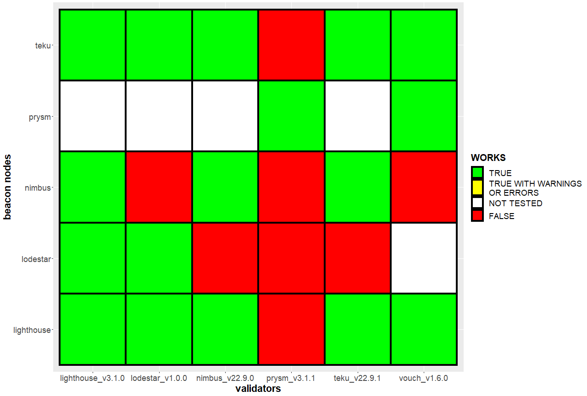
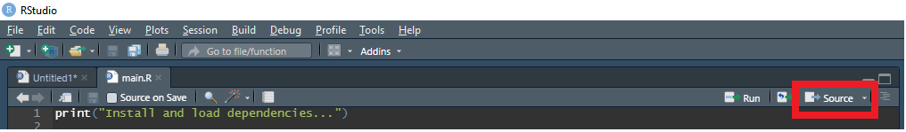

# Ethereum consensus client cross connectivity matrix

Overview of Ethereum CL client cross connectivitiy.

All findings are based on personal experience and/or by findings of the community.

Repository related topics are mostly discussed in the [client diversity channel of the ETHSTAKER discord](https://discord.com/channels/694822223575384095/933102729952395344).

## Cross connectivity plot

<!-- markdownlint-disable-next-line MD036 -->
**CURRENTLY ONLY TESTED ON GOERLI/PRATER**

<!-- markdownlint-disable-next-line MD036 -->
**IT IS ONLY RECOMMENDED TO USE CLIENTS WHICH FULLY WORK TOGETHER (GREEN TILE)**



### Issues

| bn | vc | issue |
| --- | --- | --- |
| teku | lodestar | `NOT REPORTED YET` |
| nimbus | lighthouse/teku/vouch | <https://github.com/status-im/nimbus-eth2/issues/3920> |
| nimbus | lodestar | `NOT REPORTED YET` |
| lodestar | nimbus | `NOT REPORTED YET` |
| lodestar | teku | `NOT REPORTED YET` |
| lighthouse | lodestar | `NOT REPORTED YET` |

### Notes

#### Prysm

I didn't test prysm yet. This data will be added soon (hopefully).

#### Vouch

Vouch is a validator client only, which is why it does not have it's own bn row.

## Repositories

This section includes all client repositories for further information:

* [lighthouse](https://github.com/sigp/lighthouse)
* [teku](https://github.com/ConsenSys/teku)
* [nimbus](https://github.com/status-im/nimbus-eth2)
* [lodestar](https://github.com/ChainSafe/lodestar)
* [vouch](https://github.com/attestantio/vouch)
* [prysm](https://github.com/prysmaticlabs/prysm)

## mev-boost

The plot does not include `mev-boost` since only the beacon client is connected to that tool. So any issue with `mev-boost` can be traced back to:

* the connection between the beacon client and `mev-boost` or
* the connection between the beacon and the validator client

The first issue is tracked by flashbots itself via the [mev-boost website](https://boost.flashbots.net/). Here you will also find a compatibility table.

The second issue is tracked by this repository or the cross connectivity plot respectively.

## Add your findings

### Code

The code to create the connectivity matrix plot is written in `R`, a statistical computing language.

The code was tested and executed with the latest version of `R` (`4.2.1`).

### Add your data

The data is stored under `./data/connectivity.R`.

Just adapt the respective client combination with `TRUE`, `FALSE`, `NA` or the variable `WARNING` and submit your findings via a feature branch and pull request.

### Create the plot

You can also execute the scripts and add the plot while adding your data to the repository.

To do so just add your data as described above and run the `main.R` script.

You can run the script in two ways:

1. From the R console:

   ```R
   # change your working directory to the root of the repository
   setwd("<path-to-repository-root>")
   # Run the script
   source("./main.R")
   ```

1. From RStudio
  
    * open `main.R` in RStudio
    * Click 'Source' in RStudio

## ToDo

1. Create two matrix plots
   * one for Goerli/Prater
   * one for mainnet

## ABBREVIATIONS

| abbreviation | long |
| --- | --- |
| bn | beacon node/client |
| vc | validator client |
