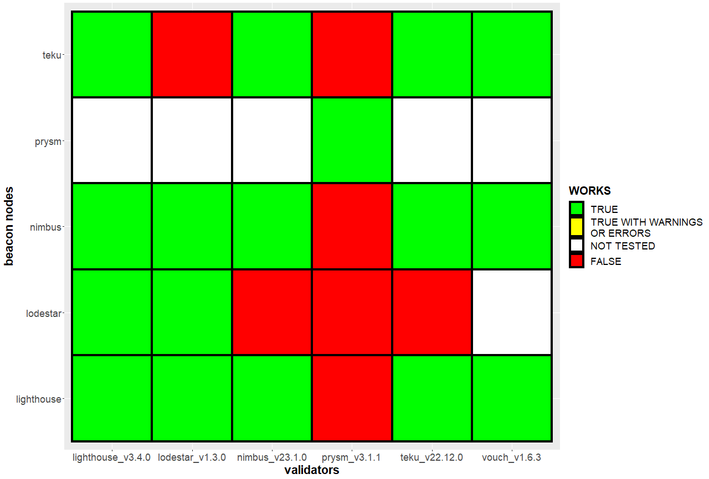

# Ethereum consensus client cross connectivity matrix

Overview of Ethereum CL client cross connectivitiy.

## Cross connectivity plot

<!-- markdownlint-disable-next-line MD036 -->
**CURRENTLY ONLY TESTED ON GOERLI/PRATER**



### Notes

#### General

All client combinations which have a green rectangle will work together which means the validator will send attestations and propose blocks successfully. However, some client combinations still create some `warnings` or `errors` which I will clarify with the client teams.

Furthermore I will, of course, also reach out to the client teams if a specific validator does not work with a specific beacon node (see plot).

#### Prysm

I didn't test prysm yet. This data will be added soon (hopefully).

#### Vouch

Vouch is a validator client only, which is why the bn row of vouch is fully red. I will improve the code so the bn row of vouch will not be displayed at all.

## Repositories

This section includes all client repositories for further information:

* [lighthouse](https://github.com/sigp/lighthouse)
* [teku](https://github.com/ConsenSys/teku)
* [nimbus](https://github.com/status-im/nimbus-eth2)
* [lodestar](https://github.com/ChainSafe/lodestar)
* [vouch](https://github.com/attestantio/vouch)
* [prysm](https://github.com/prysmaticlabs/prysm)

## Code

The code to create the connectivity matrix plot is written in `R`, a statistical computing language.

The code was tested and executed with the latest version of `R` (`4.2.1`).

## Add your data

The data is stored under `./data/connectivity.R`.

Just adapt the respective client combination with `TRUE`, `FALSE` or `NA` and submit your findings via a feature branch and pull request.

## Create the plot

You can also execute the scripts and add the plot while adding your data to the repository.

To do so just add your data as described above and run the `main.R` script.

You can run the script in two ways:

1. From the R console:

   ```R
   # change your working directory to the root of the repository
   setwd("<path-to-repository-root>")
   # Run the script
   source("./main.R")
   ```

1. From RStudio
  
    * open `main.R` in RStudio
    * Click 'Source' in RStudio

## ToDo

1. Increase legend and axis titles
1. Add yellow as separate color
   * validator works on bn but produces errors or warnings
1. Improve code so that `vouch` does not get a separate bn row
1. Create two matrix plots
   * one for Goerli/Prater
   * one for mainnet
